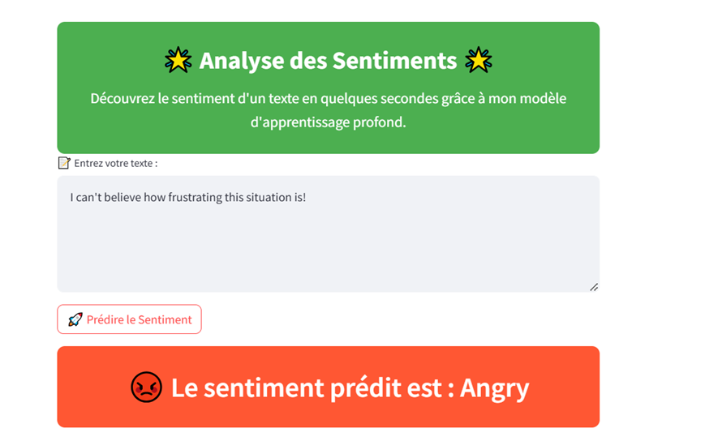
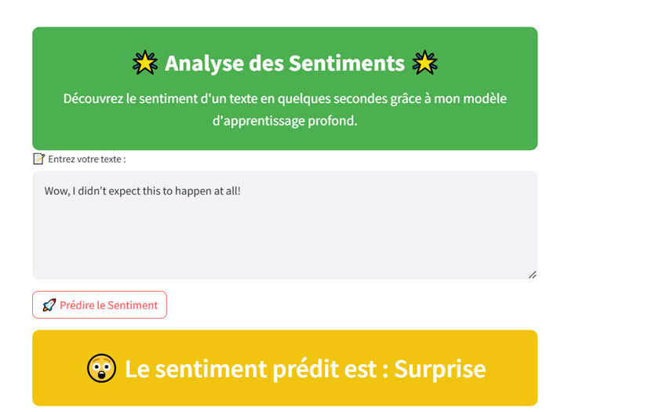

<h1>🧠 Sentiment Analysis with Neural Networks</h1>

<h2>📌 Description</h2>

This project utilizes <b>sequential neural network models</b> such as <b>RNN</b>, <b>LSTM</b>, and <b>GRU</b> to perform <b>sentiment analysis</b>.  
The goal is to classify texts into different emotions, including:  

<ul>
  <li>😡 <b>Anger</b></li>
  <li>😨 <b>Fear</b></li>
  <li>😄 <b>Happiness</b></li>
  <li>😢 <b>Sadness</b></li>
  <li>😲 <b>Surprise</b></li>
  <li>😐 <b>Neutral</b></li>
</ul>

The data is sourced from the <a href="https://www.kaggle.com/datasets/nelgiriyewithana/emotions">Emotions</a> dataset for BI-GRU, a rich dataset for emotion analysis.  
The data is sourced from the <a href="https://www.kaggle.com/datasets/debarshichanda/goemotions">GoEmotions</a> dataset for LSTM.
A user interface has been created with <b>Streamlit</b> to test the model in real-time.

---

<h2>🚀 Features</h2>
<ul>
  <li>🧪 <b>Text classification</b> into six main emotions.</li>
  <li>🧠 Advanced model training using <b>LSTM | BI-GRU</b>.</li>
  <li>🔄 <b>Data preprocessing</b>:
    <ul>
      <li>Stopword removal.</li>
      <li>Text lemmatization.</li>
      <li>Cleaning and tokenization.</li>
    </ul>
  </li>
  <li>⚙️ Handling imbalanced data through <b>upsampling</b>.</li>
  <li>🌐 Interactive interface developed with <b>Streamlit</b>.</li>
</ul>

---

<h2>📂 Technologies Used</h2>

Here are the main libraries and frameworks used in this project:

<ul>
  <li><b>Python 3.8+</b></li>
  <li><a href="https://streamlit.io/">Streamlit</a> - For the user interface.</li>
  <li><a href="https://www.tensorflow.org/">TensorFlow/Keras</a> - For neural network models.</li>
  <li><a href="https://pandas.pydata.org/">Pandas</a> - Data manipulation.</li>
  <li><a href="https://numpy.org/">NumPy</a> - Numerical computations.</li>
  <li><a href="https://plotly.com/python/">Matplotlib & Plotly</a> - Results visualization.</li>
  <li><a href="https://www.nltk.org/">NLTK</a> - Text preprocessing.</li>
  <li><a href="https://scikit-learn.org/">Sklearn</a> - Data preparation and label encoding.</li>
</ul>

---

<h2>📊 Results & Visualizations</h2>
<h3>User Interface Example:</h3>
- For the Angry class:  
    
- For the Surprise class:  
  
